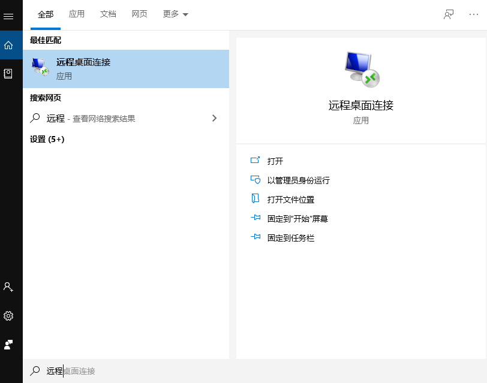
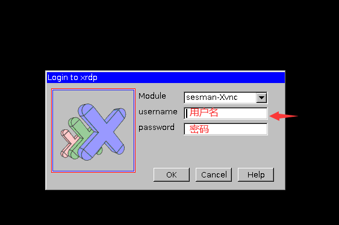
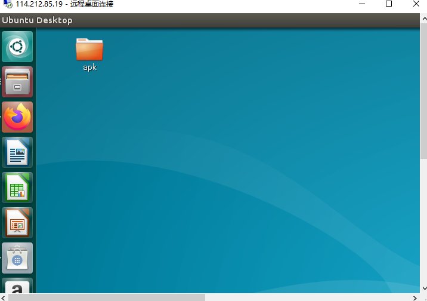

# win10远程连接原生的ubuntu16.04桌面

## 引言

远程连接Linux服务器的方式多种多样，有：

1. SSH连接 命令行样式

2. 可视化连接 桌面风格

今天我们主要介绍的是可视化连接, 故名思意即远程桌面控制，常见的可视化连接有两种
**xrdp**和 **vnc**，在这里我们对比一下这两者的区别
## xrdp 与 vnc 区别


## 通过XDRP实现Windows远程连接
**不推荐这种方法**，该方法是通过第三方桌面系统实现远程访问，部分图形化软件的功能不能使用，可能会包报错误信息如下
"""markdown
failed to initialize sdl no available video device
"""

**服务器端配置**
客户端配置很简单，我们会在下面介绍
 1. #安装xrdp 
> sudo apt-get install xrdp 
 2. #安装vnc4server 
> apt-get install vnc4server tightvncserver
 3. #安装xubuntu-desktop 
> sudo apt-get install xubuntu-desktop 
 4. #向xsession中写入xfce4-session 
> echo “xfce4-session” >~/.xsession 
 5. #开启xrdp服务 
> sudo service xrdp restart

客户端连接之后，显示

下面讲解的是如何直接访问原生系统,小编比较推荐这种方法

## 通过VNC实现Windows远程连接

**服务器端配置**

 1. 下载TigerVNC Server软件包

> 小编已经帮大家下载好啦，见本项目中的文件：

> tigervncserver_1.6.80-4_amd64.deb

 2. 安装TigerVNC Server软件包


```markdown
cd ~
mkdir tigervncserver
cd tigervncserver
sudo dpkg -i tigervncserver_1.6.80-4_amd64.deb
或者
sudo apt-get install tightvncserver
```

此时很有可能会安装出错，如下所示，说明软件安装前的依赖信息没有安装

```markdown
(Reading database ... 435232 files and directories currently installed.)
Preparing to unpack tigervncserver_1.6.80-4_amd64.deb ...
Unpacking tigervncserver (1.6.80-4) over (1.6.80-4) ...
dpkg: dependency problems prevent configuration of tigervncserver:
 tigervncserver **depends** on libtasn1-3-bin; however:
  Package libtasn1-3-bin is not installed.
```

运行以下命令安装依赖，更新完依赖之后继续上述安装命令
> sudo apt-get -f install

 3. 配置xrdp设置

> echo unity>~/.xsession
 
 4. 打开ubuntu的桌面共享功能

 进入系统-》首选项-》桌面共享，或者直接搜索桌面共享，如图所示

**客户端配置**

1. 开始菜单里搜索远程桌面功能，如下图所示



2. 在服务器端查看ip地址,输入命令

> ifconfig

3. 随后输入用户名和密码



4. 随后输入用户名和密码

至此，xrdp连接Ubuntu 16.04的所有步骤已完成，如图所示是不是很**熟悉**



## 如若本文图片未显示

请点击链接[解决GitHub中图片不显示](https://github.com/Jmt1995/PictureError)


